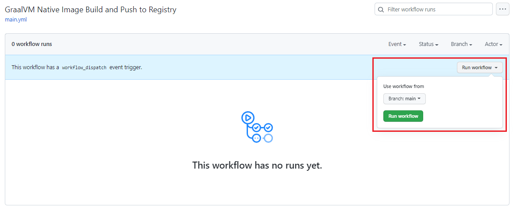
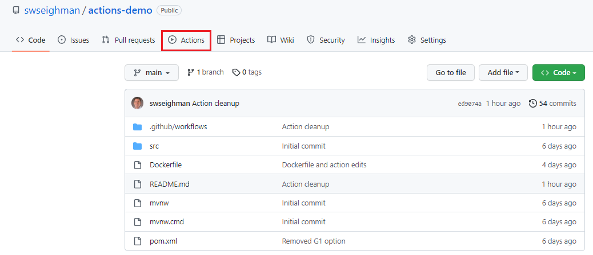
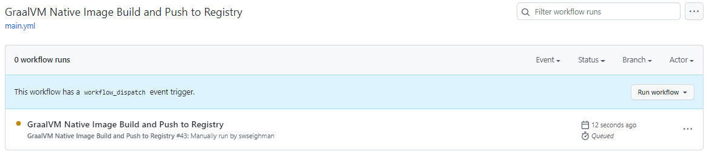
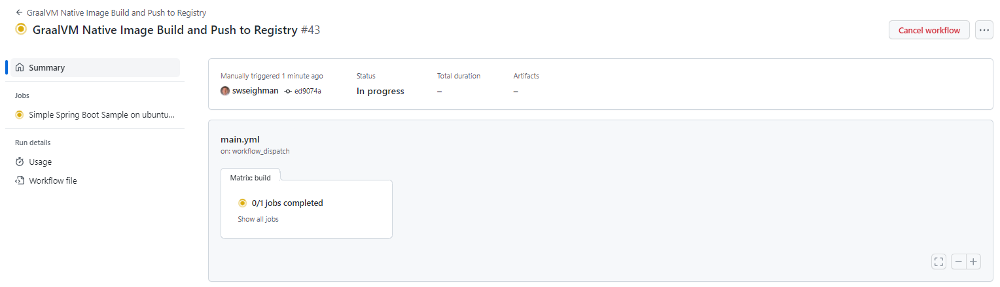
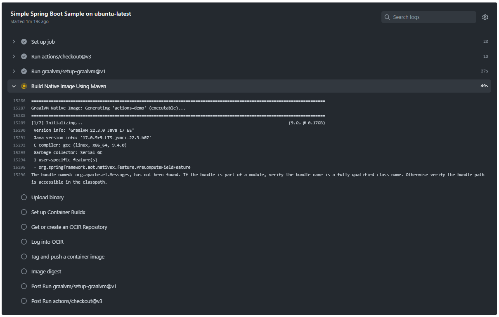
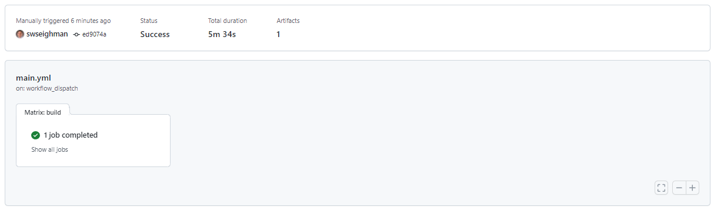
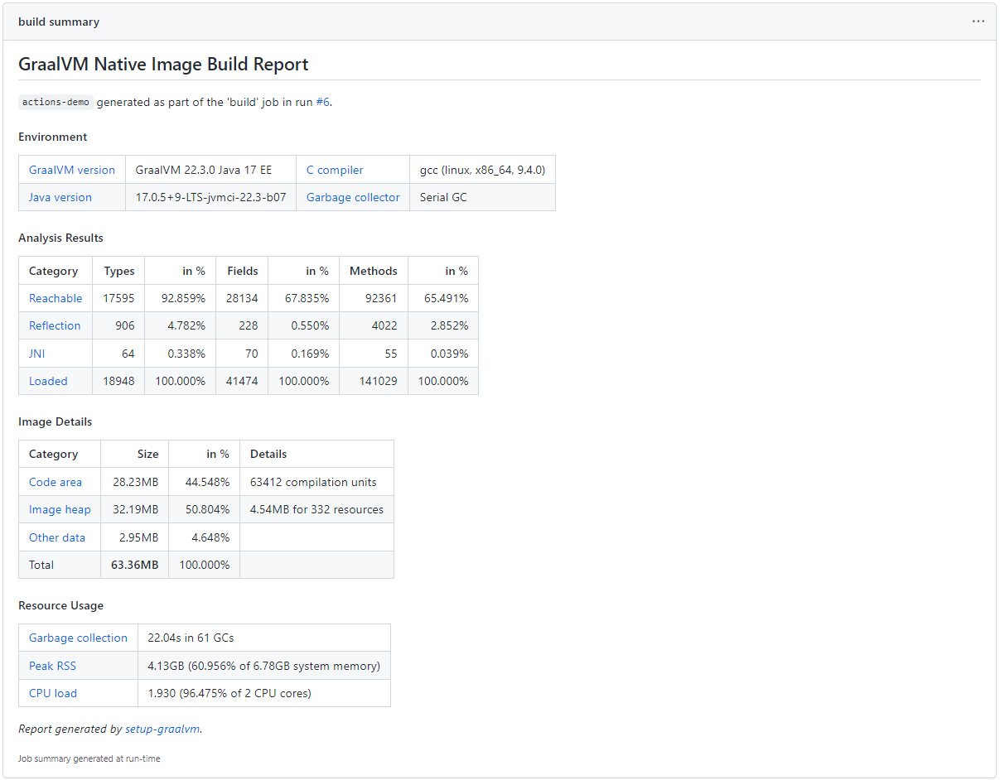
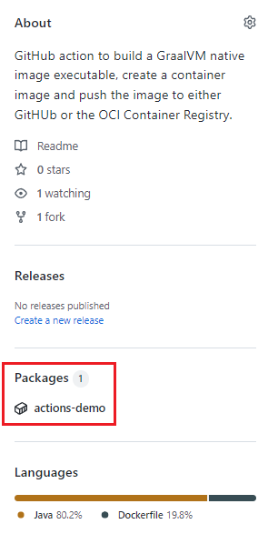
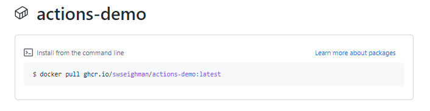

# Demo Using GraalVM GitHub Actions

This example will use [GitHub Action for GraalVM](https://github.com/marketplace/actions/github-action-for-graalvm) with a simple Spring Boot project.

The action will create a GraalVM native image from a Spring Boot project, create a container and push the container to a repository (either GitHub or Oracle Cloud Infrastructure).

Clone/download the repository:
```
$ git clone https://github.com/swseighman/Actions-Demo.git
$ cd Actions-Demo
```

The project will build without any changes, but if you make some changes to the project and `git push` the updates, this will trigger the GitHub action(s).

>By default, the action is configured to automatically trigger the job but you can easily change the default behavior by editing the action.
>
>Replace `[main]` on line 6 of the `main.yml` file with `none`:
>
>```
>1. name: GraalVM Native Image Build and Push to Registry
>2. 
>3. on:
>4.   push:
>5.   # Replace none with [ main ] to automatically trigger the action on push
>6.     branches: [main]
>7.   pull_request:
>8.     branches: none
>9.   # Allows you to run this workflow manually from the Actions tab
>10.   workflow_dispatch:
>```
>
>After changing line 6:
>```
>1. name: GraalVM Native Image Build and Push to Registry
>2. 
>3. on:
>4.   push:
>5.   # Replace none with [ main ] to automatically trigger the action on push
>6.     branches: none
>7.   pull_request:
>8.     branches: none
>9.   # Allows you to run this workflow manually from the Actions tab
>10.   workflow_dispatch:
>```
>Now you can manually trigger the action by clicking on the `Run Workflow` button under the `Actions` tab on GitHub:
>
>

After you modify the `main.yml` file (or any of the project files), push the update(s) to configure automatic/manual execution of the action:

```
$ git add .github/workflows/main.yml
$ git commit -m "Configure trigger behavior"
[main ed9074a] Configure trigger behavior
 2 files changed, 42 insertions(+), 1 deletion(-)
$ git push -u origin main
```

Open a browser and open the GitHub project, then click on `Actions`:



You should see a new workflow job in progress:



Clicking on the action will provide additional info on the build status:





At the conclusion of the build, you should see the job completed successfully:



In addition, with the `native-image-job-reports: 'true'` configuration parameter enabled in the `main.yml` file, a summary of the build is also displayed:




### Accessing the Container Images

Based on the configuration in the `main.yml` file, you can either push the image to GitHub or OCIR.  You'll need to comment/uncomment the appropriate section in the `main.yml`, labeled `Login to GitHub` or `Login to Oracle Container Registry`.

By default, the job is configured for OCIR so you'll need to add OCI secrets to the project settings, including:

```
OCI_CLI_USER
OCI_CLI_TENANCY
OCI_CLI_FINGERPRINT
OCI_CLI_KEY_CONTENT
OCI_CLI_REGION
OCI_COMPARTMENT_OCID
OCI_AUTH_TOKEN
```

More info on the OCI environment variables can be found [here](https://docs.oracle.com/en-us/iaas/Content/API/SDKDocs/clienvironmentvariables.htm).

To use the GitHub repository (in addition to the Login lines), uncomment lines 12-14 in `main.yml`:

```
env:
  REGISTRY: ghcr.io   # Uncomment if you're pushing to GitHub
  IMAGE_NAME: ${{ github.repository }}  # Uncomment if you're pushing to GitHub
```

If you push to your GitHub repository, you can access the container image by clicking on the `Packages` link on the main project page:



Then execute the pull command to download the container image:



You can pull the image directly by executing the following command:

```
$ docker pull ghcr.io/swseighman/actions-demo:latest
```

To run the container:
```
$ podman run --rm -p 8080:8080 ghcr.io/swseighman/actions-demo
```

To download the container image from OCIR, login to the registry:

```
$ podman login iad.ocir.io
Username: <tenancy-namespace>/oracleidentitycloudservice/<your-email>
Password: <Use Auth-Token>
Login Succeeded!
```

To pull the image:
```
$ podman pull iad.ocir.io/<tenancy-namespace>/actions-demo:native
Trying to pull iad.ocir.io/<tenancy-namespace>/actions-demo:native...
Getting image source signatures
Copying blob 38fac89bc44d skipped: already exists
Copying blob 1c31d27bdbd7 done
Copying config 39db03c3b8 done
Writing manifest to image destination
Storing signatures
39db03c3b82d4db91da36f4f459688641f905763ce2da455cd4c5c780d639e05
```

To run the container:
```
$ podman run --rm -p 8080:8080 iad.ocir.io/<tenancy-namespace>/actions-demo:native
```

### Summary


